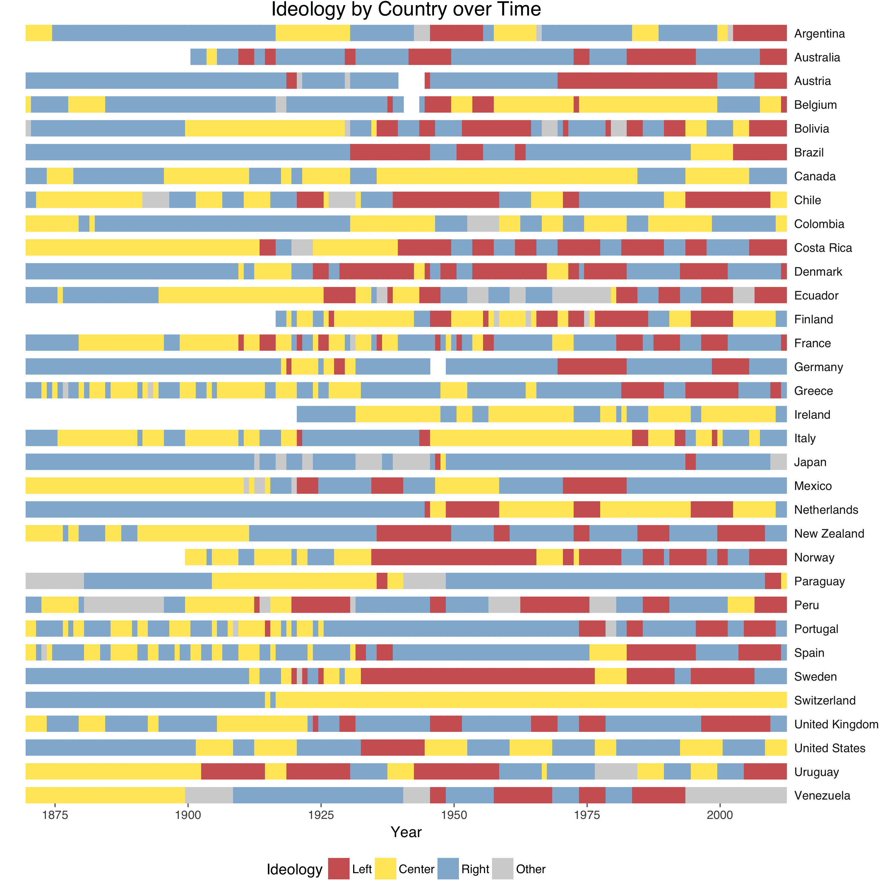

```{r Setup, warning=FALSE, include=FALSE, results='hide'}
library(knitr)

# Load packages.
packages <- c("readxl","plyr","readstata13","reshape2","dplyr","ggthemes","plotly",
              "countrycode","readr","DescTools","DT")

packages <- lapply(packages, FUN = function(x) {
  if(!require(x, character.only = TRUE)) {
    install.packages(x)
    library(x, character.only = TRUE)
  }
})

data_location <- "/Users/tbrambor/Dropbox (Pflegedienst Brambor)/Reform_Capacity_TB/Research_Assistance/Leaders/"

# data_location <- "C:/Users/svet-jlv/Dropbox/Research Assistance/Leaders/"

```

The **Heads of Government (HoG)** dataset provides summary information about the **ideological orientation of heads of government** in **33 countries** in Europe, Latin America, North America, and the Asia-Pacific region **between 1870 and 2012**.

Our coding of head-of-government ideology has two dimensions: on the one hand the **economic dimension** (we distinguish between “left,” “center,” and “right”); on the other hand the **religious dimension** (we distinguish between heads of government with an explicitly Christian platform and those without an explicitly Christian platform).

```{r, message=FALSE, warning=FALSE, echo=FALSE}
hogcy <- read_excel(paste(data_location,"/v1.4/HoG_dataset_country_year_v1.4.xls",sep=""))

hogcy$hogideo <- factor(hogcy$hogideo, levels = c("L","C","R","O"))
hogcy$hogideo <- revalue(hogcy$hogideo, c(L = "Left", C = "Center", R = "Right", O = "Other"))
detach("package:plyr", unload=TRUE)

## Add BMR data
library(readstata13)
bmr <- read.dta13(paste(data_location,"/codebook/boix_temporary.dta",sep=""))

data <- dplyr::left_join(hogcy, bmr, by = c(year="year", ccodecow = "ccodecow"))
```


## Head-of-Government Ideology by Regime Type

To following graphs provide a quick overview of the coding of the ideology of heads of government over time.

```{r, message=FALSE, warning=FALSE, echo=FALSE, dpi=300}
theme_new <- function(base_size = 12, base_family = "Helvetica"){
  theme_few(base_size = base_size, base_family = base_family) %+replace%
    theme(
      #line = element_line(colour="black"),
      #text = element_text(colour="black"),
      #axis.text = element_text(colour="black", size=8),
      #strip.text = element_text(size=12),
      #legend.key=element_rect(colour=NA, fill =NA),
      panel.grid = element_blank(),   
      panel.border = element_blank(),
      plot.title = element_text(size=base_size+4, vjust=3, hjust = 0.5)
      )
}

# Colors for the ideology categories (L,C,R,O)
color3 <- c("#cf6363","#ffe866","#91b6d4")
color4 <- c("#cf6363","#ffe866","#91b6d4","#D3D3D3")

#color4 <- c("#ef8a62","#fee090","#67a9cf","#D3D3D3")

## Graph Ideology for all Regimes
data %>% 
  dplyr::filter(hogideo!="Other") %>% 
  group_by(year, hogideo) %>% 
  summarise(count=n()) %>% 
  mutate(perc=count/sum(count)) %>%
ggplot(aes(x=year, y=perc, fill=hogideo)) + 
  geom_bar(position = "stack", stat = "identity", size = 0, width=1.1) +
  scale_fill_manual(values=color3) + 
  labs(x = "Year", y = "Proportion of Countries", title = "All Regimes", fill = "Ideology") + 
  scale_x_continuous(breaks = seq(1875,2000,25), expand = c(0, 0)) + scale_y_continuous(expand = c(0, 0)) +
  theme_new() -> g_all

## Graph Ideology for all Democracies
data %>% 
  dplyr::filter(boix_democracy == 1) %>% 
  dplyr::filter(hogideo!="Other") %>% 
  group_by(year, hogideo) %>% 
  summarise(count=n()) %>% 
  mutate(perc=count/sum(count)) %>%
ggplot(aes(x=year, y=perc, fill=hogideo)) + 
  geom_bar(position = "stack", stat = "identity", size = 0, width=1.1) +
  scale_fill_manual(values=color3) + 
  labs(x = "Year", y = "Proportion of Countries", title = "Democracies", fill = "Ideology") + 
  scale_x_continuous(breaks = seq(1875,2000,25), expand = c(0, 0)) + scale_y_continuous(expand = c(0, 0)) +
  theme_new() + theme(plot.title = element_text(vjust=30)) -> g_dem

## Graph Ideology for all Dictatorships
data %>% 
  dplyr::filter(boix_democracy == 0) %>% 
  dplyr::filter(hogideo!="Other") %>% 
  group_by(year, hogideo) %>% 
  summarise(count=n()) %>% 
  mutate(perc=count/sum(count)) %>%
ggplot(aes(x=year, y=perc, fill=hogideo)) + 
  geom_bar(position = "stack", stat = "identity", size = 0, width=1.1) +
  # scale_fill_grey() +
  scale_fill_manual(values=color3) + 
  labs(x = "Year", y = "Proportion of Countries", title = "Dictatorships", fill = "Ideology") + 
  scale_x_continuous(breaks = seq(1875,2000,25), expand = c(0, 0)) + scale_y_continuous(expand = c(0, 0)) +
  theme_bw() -> g_dic

```

```{r, message=FALSE, warning=FALSE, echo=FALSE, dpi=300}
## Combined Graph for Website
data %>% 
  dplyr::filter(is.na(boix_democracy)==F) %>% 
  dplyr::filter(hogideo!="Other") %>% 
  mutate(Regime = "All Regimes") %>%
  group_by(year, Regime, hogideo) %>% 
  summarise(count=n()) %>% 
  mutate(Proportion=count/sum(count)) %>%
  mutate(Ideology=hogideo) %>%
  mutate(Year=year) %>% ungroup() %>% 
  dplyr::select(Year, Regime, Ideology, Proportion) -> dat1

data %>% 
  mutate(regime = ifelse(boix_democracy==0, "Dictatorship", "Democracy") ) %>%
  dplyr::filter(is.na(boix_democracy)==F) %>% 
  dplyr::filter(hogideo!="Other") %>% 
  group_by(year, regime, hogideo) %>% 
  summarise(count=n()) %>% 
  mutate(Proportion=count/sum(count)) %>%
  mutate(Ideology=hogideo) %>%
  mutate(Year=year) %>%
  mutate(Regime=regime)  %>% ungroup() %>% 
  dplyr::select(Year, Regime, Ideology, Proportion) -> dat2

datcomb <- rbind(dat1,dat2)

ggplot(datcomb, aes(x=Year, y=Proportion, fill=Ideology, group=Regime)) + 
  geom_bar(position = "stack", stat = "identity", size = 0, width=1.1) +
  # scale_fill_grey() +
  scale_fill_manual(values=color3) + 
  labs(x = "Year", y = "Proportion of Countries \n.", fill = "") + 
  scale_x_continuous(breaks = seq(1875,2000,25), expand = c(0, 0)) + scale_y_continuous(expand = c(0, 0)) + 
  facet_grid(Regime ~ .) +
  theme_bw()  -> g_web

## Change the layout to adjust legend position
g_web2 <- as.widget(ggplotly(g_web, width=700, height=400))
g_web2$x$layout$legend$x <- 1.05 # move it to the right a bit
g_web2$x$layout$margin$l <- 90
g_web2 %>% config(displayModeBar = F)

```

## Head-of-Government Ideology by Country

The graph below is a representation of the head-of-government ideology coding for all countries in the sample.

```{r, message=FALSE, warning=FALSE, echo=FALSE, cache=FALSE, dpi=300}
countries <- unique(data$cname)

data %>% 
  group_by(cname, year, hogideo) %>% 
  summarise(count=n()) %>% 
  mutate(perc=count/sum(count)) %>%
  dplyr::filter(is.na(hogideo)==FALSE) %>% 
ggplot(aes(x=year, y=perc, fill=hogideo, group=cname)) + 
  geom_bar(position = "stack", stat = "identity", size = 0, width=1.1) +
  scale_fill_manual(values=color4) + 
  labs(x = "Year", y = "", title = "Ideology by Country over Time", fill = "Ideology") + 
  scale_x_continuous(breaks = seq(1875,2000,25), expand = c(0, 0)) + scale_y_discrete(expand = c(0, 0)) +
  theme_new() + 
  theme(strip.text.y = element_text(angle=0, hjust = 0),
        legend.position = "bottom") + 
  facet_grid(cname~.) -> g_all
```

```{r, fig.height=5, fig.width=4, message=FALSE, warning=FALSE, echo=FALSE}
ggsave(paste(data_location,"hog-website/country_plot.png", sep=""), plot=g_all, device = NULL, height=10, width=10 )
```

```{r, echo=FALSE, out.width = "80%"}

```

```{r, echo=FALSE, warning=FALSE, message=FALSE}
## Heat map alternative  -- NOT READY YET
# Need Data Matrix
library(reshape)
dat1 <- select(data, cname, year, hogideo)
dat1 <- melt(dat1, id.vars=c("cname","year"))
dat1 <- cast(dat1)
```


# The data 

To give the reader of our (online) codebook the ability to quickly peruse our database, we are providing a quick way to search the database here.

```{r, message=FALSE, warning=FALSE, echo=FALSE}
data_sel <- dplyr::select(data, cname, year, hogname, hogideo, hogrel, hogindate, hogoutdate)
datatable(data_sel)
```